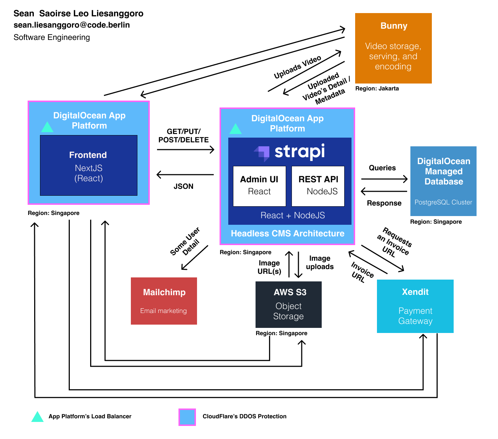

# Unbelievable Frontend

This is the repository for https://unbelievable.id.

Unbelievable.id is an on-demand video streaming platform for different courses, similar to udemy, coursera, and the likes in the form of web application. It's built using NextJS (React).

## Architecture Visualisation

In the diagram above, this application is the **"Frontend NextJS (React)"**. Unannotated arrows are the appropriate "requests" and "responses".

The requests could be an image url, video url, etc and the responses could be an image, hls, a full webpage, etc. The requests and responses depend on which two services communicating with one another.

## Local Development

The following are the steps to run the web app locally.

### Installation

To run this web app locally, you must first install the needed dependencies by running

`npm i`

### Setting .env variables

To set the environment variables, check .env.example file. Please feel free to contact me (Sean) in case you need the some (or all) of the values for the environment variables.

### Running the app

Run the following command:

`npm run dev`

the web app should run in your browser (localhost:3000)

### Running the CMS (backend)

You also need to run the backend to be able to use this web app properly. See the backend repository here to see how you can install and run it locally as well: https://github.com/shonsirsha/unbelievable-backend
